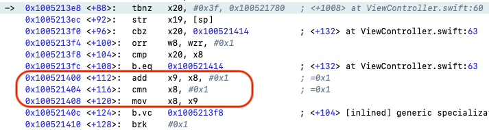

# How Fast is Swift, and Why

You probably heard how Apple *bragged* about how fast Swift is, compared with Objective C. Objective C is slow, or so have you heard.
In fact, that was one of the main reasons Swift was introduced to Apple's ecosystem --- to improve efficiency.
For individual users, a few seconds do not matter that much.
But for a company cranking out hundreds of millions devices with battery, that is huge.
Year after year, flagship iPhones outperform other flagship Android phones with 25% more battery capacity in terms of both raw benchmarks and time between recharges.

## Why is Objective C slow?

It’s a superset of the C programming language and provides object-oriented capabilities and a dynamic runtime.
Objecitve C adds syntax for defining classes and methods to C.
But unlike C++, it uses **message passing** to invoke methods.
That is where the slowness comes in.
C++ uses virtual function tables to implement **Polymorphism**.
So a call to a **virtual** function only costs one more extra hop to reach the actural code body to run.
**Message passing**, however, is a much more complicated process.
A method like this:
```objc
- (NSInteger)add:(NSInteger)a with:(NSInteger)b {
    return a + b;
}
```
adds a `selector` into its class.
A call `[calculator add:5 with:6];` would translate to a call to `objc_msgSend` with the `selector` defined earlier. `objc_msgSend` needs to find that `selector` and dispatch the call to it, or throw an exception if it can not, which would cause a crash if not properly handled.

Enough talk, let's see some numbers.

## Performance Measurement

Here is an Objective C class created for this purpose:

```objc
@interface OCCalculator : NSObject
- (NSInteger)add:(NSInteger)a with:(NSInteger)b;
@end

@implementation OCCalculator
- (NSInteger)add:(NSInteger)a with:(NSInteger)b {
    return a + b;
}

- (void)measureTime {
    CFTimeInterval start = CACurrentMediaTime();
    NSInteger sum = 0;
    for (int i = 0; i < 1000000000; i++) {
        sum = [self add:sum with:1];
    }
    CFTimeInterval endTime = CACurrentMediaTime();
    NSLog(@"Sum: %ld", sum);
    NSLog(@"Objc Total: %.8f s", endTime - start);
}
@end
```

Here is the Swift version:
```swift
class Calculator: NSObject {
    func add(_ a: Int, with b: Int) -> Int {
        return a + b
    }
}

func measureSwiftCalls(_ times: Int) {
    let calculator = Calculator()

    var sum = 0
    let startTime = CACurrentMediaTime()
    for _ in 0..<times {
        sum = calculator.add(sum, with: 1)
    }
    let endTime = CACurrentMediaTime()
    print("Sum: \(sum)")
    print("Native Swift: \(String(format: "%.8f", endTime - startTime)) s")
}

measureSwiftCalls(1000000000)

```

I use an iPhone X. Here are the numbers:
Native Swift: 0.42621721 s
Objective C: 3.79544121 s

Swift is about 9 times faster than Objective C.
Note that since we repetitively call the same Objective C `add:with`, all the subsequent calls benefit from caching.
So, Swift's performance is accurate.
Objective C would perform worst.

# Why Is Swift Faster?

Objective C finished a billion calls in less then 4 seconds.
Honestly, it is not bad at all.
iPhone X has A11 Bionic chip in it.
The A11 features an Apple-designed 64-bit ARMv8-A six-core CPU, with two high-performance cores at 2.39 GHz.
This loop can not be distributed to multiple cores.
One core, at peak speed, can process 2.39 billion of instructions.
Within mere 3.79544121 seconds, it can finish a tad more than 9 billion instructions.
Since the loop runs 1 billion times, that gives us 9 instructions per loop.
That is about as efficient as it can get even thinking in the assembly level.

Yet, Swift manages to finish one loop using just than 1.02 instruction.
That is incredible, or impossible.
To find out how, we need to look at the assembly code.



As you can see, there is no function call.
Swift automaticaly embedded the code directly in place.
It is like `inline` keyword in C++, but automatic.


